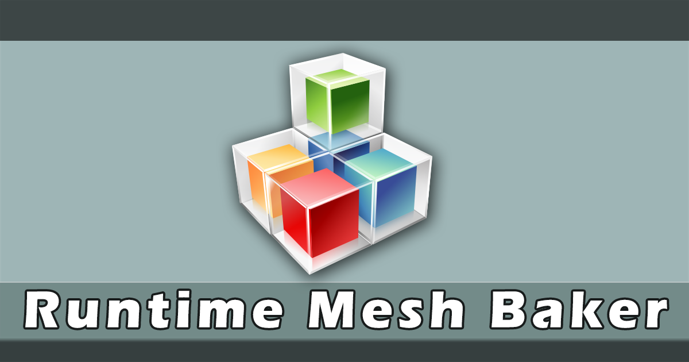
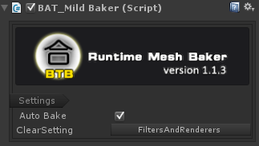

# Runtime Mesh Baker v1.2.0 #

##介绍([English Version](README.md)):

帮助你合并网格、材质和贴图，以减少DrawCall，提升你的Unity程序运行效率。
比Unity自有的静态和动态批处理要更加有效。
跟预先合并（非运行时合并）相比，不会产生冗余资源。

- ★ 支持在运行时合并来自多个游戏对象的mesh
- ★ 支持多次重复合并，可以合并后增减合并单元，再次合并
- ★ 支持子网格(sub-meshes)合并和多材质合并
- ★ 超级简单，一分钟学会，运行时操作也很便捷
- ★ 最高效的合并解决方案,可与任意的材质和shader兼容
- ★ 可以获得比Unity系统的静态/动态批处理更高效的DrawCall降低率
- ★ 运行时合并速度很快,自动回收合并后的垃圾资源
- ★ 由于不使用预先（打包前）合并，因此不存在额外的资源占用

警告:  此工具不能合并那些单个网格已经超越了64k个顶点的网格单元，因为这是Unity的网格合并上限。也就是说当你的有两个或者两个以上的网格加起来的顶点数不超越64k时，使用此工具才会获得性能优化（正常而言，对于手机游戏的网格顶点不会如此复杂，绝大部分情况下应该都存在优化空间）。

Home Page:[https://github.com/AndrewFanChina/RuntimeMeshBaker](https://github.com/AndrewFanChina/RuntimeMeshBaker) 
Support Mail: [mailoflonelywalker@qq.com](mailoflonelywalker@qq.com) 

##版本历史:
Version 1.2.0 2019.10.26
- 新功能：支持多次重复合并，可以合并后增减合并单元，再次合并
- 新功能：支持按区域合并，以便于可以为大世界的优化提供部分功能支持
- 废弃功能：深度合并以及SkinnedMesh合并，由于考虑到实际运行时的高性能需求，去除这两项不太实际需要的功能

Version 1.1.3 2017.11.15

- 新功能: 优化MildBaker的合并效率
- 修复了bug: skinned-meshes合并时偶尔会产生的一个错误
- 修复了bug: MildBaker的子网格合并时偶尔会产生的一个错误
- 增加了示例: 为MildBaker增加一个合并示例，资源来自unitytank

Version 1.1.2 2017.9.18

- 新功能：支持相同材质的skinned-meshe合并

Version 1.1.1 2017.9.10

- 新功能：支持运行时合并
- 新功能：支持子网格和多材质合并

##下载地址:

[Runtime Mesh Baker Of AssetStore](https://www.assetstore.unity3d.com/#!/content/90510)

##使用方法:

1. 准备好你要合并的游戏对象，注意要合并的游戏对象不能含有动画等运动的功能。
2. 把要合并的静态对象放在同一个树状层次结构中，让它们拥有一个共同的父节点。
3. 选择这个父节点，选择以下菜单，点击运行，即可看到合并结果。
 
 - "Window/Rumtime Mesh Baker/Add MeshBaker"
   

以上是手动添加组件的方式，如果你希望使用代码在你的游戏进行过程中调用合并功能，可以在您的工程添加以下调用代码:
	
		gameObject.AddComponent<BAT_MildBaker>();
	

##Mesh Baking 合并组件的参数解释:

- Auto Bake: 是否自动合并，如果不勾选，则不会运行时自动合并，需要添加合并命令代码。
- Seperate Shadow: 是否分离投影体，即将根据材质分组合并完成的多组显示对象，统一合并一个投影体，而显示分组设置为不投影，这有助于减少投影计算
- Region Size: 分区域合并时使用的区域尺寸，如果不需要分区域合并，将此值设置为一个很大的数值
- Show Region Gizmo: 显示分区合并使用的参考网格

##合并流程:

1. 搜索目标父节点,检查所有的目标单元gameobject，收集它的MeshFilter 和 MeshRenderer信息。
2. 整理所有的网格和材质信息，然后将目标单元分为不同类型的分组，并根据材质、分区ID分组。
3. 合并过程中使用原有的材质，不产生新的材质和贴图。
4. 创建一个新的合并节点，开始网格的分组合并，如果本组网格的顶点数超越最大限制，则会将多余的网格合并到新的节点上。
5. 为新合并的网格设置MeshFilters和MeshRenderers组件，它们使用当前分组的共享材质。
6. 执行清除和隐藏操作，将隐藏被合并单元的MeshRenderer属性，因为已经使用新的合并结果用于呈现。

